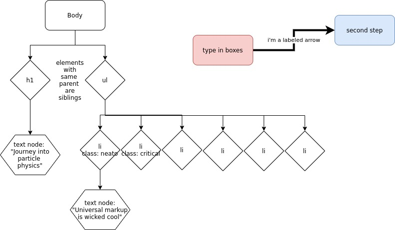

# python2_eric

## about the course
Designed for students with basic programming skills, preferably in python.

## Great Quote
From the Monty Python and the Holy Grail

    Come and see the violence inherent in the system. 
    Help! Help! I’m being repressed!

## Screen shots of diagrams are brain food
Creating diagrams quickly is possible with the Google drive "app" called draw.io.

## Hall hail python.org
Students are encouraged to source their knowledge from experimentation and careful reading of the official documentation via [python.org](http://python.org)

